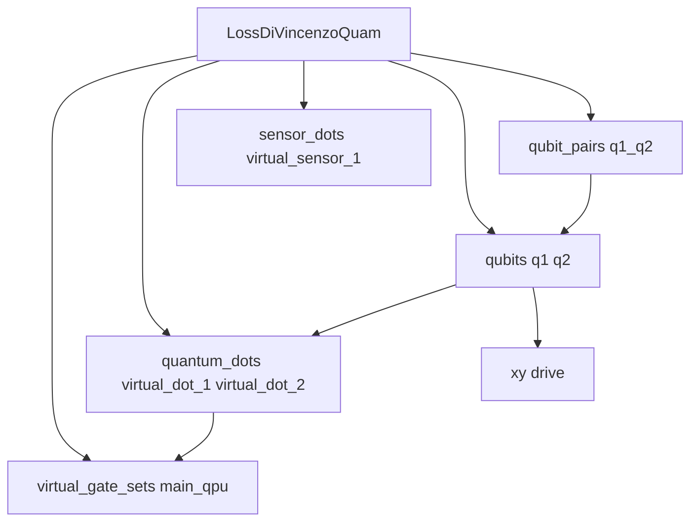

# Quantum-dot QuAM architecture

This package (`quam_builder.architecture.quantum_dots`) provides QuAM components, voltage-control tooling, default operations and macros, and wiring helpers for **quantum-dot and spin-qubit** processors.

It is aimed at:

- Labs **building a machine from connectivity specs** (recommended: [`quam_builder.builder.quantum_dots`](../../builder/quantum_dots/)).
- Experimentalists **moving from raw QUA** to a structured QuAM machine (components, named voltage points, macros, and `wire_machine_macros`).

You can use the **builder** to generate a full machine, or assemble **components piecemeal** when you need a custom topology. Child READMEs cover specific areas in depth; this document is the onboarding hub.

## Why this package

Spin-qubit experiments combine **sticky DC gate control**, **microwave drive**, and **readout** in one QUA program. Without structure, that usually means ad-hoc channel dicts, copy-pasted pulse blocks, and manual tracking of absolute gate voltages across ramps.

This package replaces that with a **serialized QuAM machine**: named voltage points, default macros, and wiring helpers so experiments read like `qubit.initialize()` / `qubit.x180()` instead of low-level `play`/`ramp` on every gate.

**Before (raw QUA sketch):**

```python
from qm.qua import program, play, wait, amp

# Manual delta pulses; easy to lose track of absolute levels with sticky elements
with program() as prog:
    play("initialize" , "plunger_1")
    play("initialize", "plunger_2")
    play("gaussian_x180", "q1_xy")
    play("initialize_to_measure", "plunger_1")
    play("initialize_to_measure", "plunger_2")
    measure("readout", "readout")
```

**After (QuAM + macros):**

This constructs a QUA program from the tutorial machine.

```python
from qm.qua import program
from quam_builder.architecture.quantum_dots.examples.tutorial_machine import (
    build_tutorial_machine,
)

machine = build_tutorial_machine()
q1 = machine.qubits["q1"]
q1_q2 = machine.qubit_pairs["q1_q2"]
with program() as prog:
    q1_q2.initialize()
    q1.x180()
    q1_q2.measure()
```

## Mental model

Different machine roots:

| Root | Use when |
|------|----------|
| **`BaseQuamQD`** | Calibrating **dots and gates** without a full spin abstraction. |
| **`LossDiVincenzoQuam`** | Running **ESR/EDSR and two-qubit** experiments on the same dot connectivity. |
| **`ExchangeOnlyQuam`** | Running **Exchange Only Qubit** experiments on the same dot connectivity. (In Progress)|
| **`SingletTripletQuam`** | Running **Singlet/Triplet Qubit** experiments on the same dot connectivity. (In Progress)|

A staged lab typically starts with `BaseQuamQD`, saves the charge-calibrated state, then upgrades to the relevant `QubitQuam`. The tutorial machine is already a `LossDiVincenzoQuam` so you can inspect the full tree offline.

## 15-minute offline quickstart

Build a tutorial machine and generate the configuration.

```python
from qm.qua import program
from quam_builder.architecture.quantum_dots.examples.tutorial_machine import (
    build_tutorial_machine,
)
from quam_builder.architecture.quantum_dots.qpu import LossDiVincenzoQuam

machine = build_tutorial_machine() # Builds a LossDiVincenzoQuam
config = machine.generate_config() # Generates the config used in QuantumMachinesManager.open_qm(config)
machine.save("quam_state") # Save the quam state to a json file
```

Inspect the machine and config above to see how components translate to configuration.
`build_tutorial_machine()` produces a live `LossDiVincenzoQuam` with gate set id `"main_qpu"`. Dots and qubits delegate voltage moves through **`VoltageSequence`** on that gate set:



Reload the Quam state, and construct a QUA program. No hardware connection is opened.

```python
loaded = LossDiVincenzoQuam.load("quam_state") # Load the same state from file
q1 = loaded.qubits["q1"] # Choose a qubit to interact with
with program() as prog:
    q1.initialize() # run predefined macros that translate to Qua play commands
    q1.x180()
    q1.measure()

```

Macros use **placeholders**, not device-safe defaults. Do not apply these voltages to hardware.

## Generating pulse sequences with QuaM

QuaM components provide high-level methods to generate voltage sequences and pulse programs. Here's how to use the key voltage control methods:

Define named points **outside** the QUA program (they are stored on the machine). Navigate with `step_to_point` / `ramp_to_point`, or pass absolute voltages with `step_to_voltages` / `ramp_to_voltages`. Targets are absolute levels, not deltas; omitted gates keep their last value (`keep_levels=True`).

```python
from qm.qua import program
from quam_builder.architecture.quantum_dots.examples.tutorial_machine import (
    build_tutorial_machine,
)

machine = build_tutorial_machine()
q1 = machine.qubits["q1"]
dot_id = q1.quantum_dot.id  # "virtual_dot_1"

q1.add_point("idle", {dot_id: 0.0}, duration=200)
q1.add_point("load", {dot_id: 0.10}, duration=200)

with program() as prog:
    q1.step_to_point("idle")
    q1.ramp_to_point("load", ramp_duration=64)
    q1.step_to_voltages({dot_id: 0.15}, duration=200)
    q1.ramp_to_voltages({dot_id: 0.0}, duration=200, ramp_duration=64)
    q1.align()
```

`duration` and `ramp_duration` are in **nanoseconds**. For several dots at once, put every channel in one dict or use `machine.voltage_sequences["main_qpu"]` (see [voltage_sequence/README.md](voltage_sequence/README.md)).

## Turning pulse sequences into custom macros

Wrap a pulse sequence in a `@quam_dataclass` `QuamMacro` so you can call it as `q1.initialize()`. Register named voltage points on the machine; the macro only navigates them.

This example empties the dot, then ramps to `load`:

```python
from qm.qua import program
from quam.core import quam_dataclass
from quam.core.macro import QuamMacro

from quam_builder.architecture.quantum_dots.examples.tutorial_machine import (
    build_tutorial_machine,
)
from quam_builder.architecture.quantum_dots.macro_engine import wire_machine_macros
from quam_builder.architecture.quantum_dots.operations.names import SingleQubitMacroName

@quam_dataclass
class EmptyThenLoadInitialize(QuamMacro):
    empty_point: str = "empty"
    load_point: str = "load"
    ramp_duration: int = 64

    def apply(self, **kwargs):
        qubit = self.parent
        while not hasattr(qubit, "step_to_point"):
            qubit = qubit.parent
        qubit.step_to_point(self.empty_point)
        qubit.ramp_to_point(self.load_point, ramp_duration=self.ramp_duration)

machine = build_tutorial_machine()
q1 = machine.qubits["q1"]
dot_id = q1.quantum_dot.id

q1.add_point("empty", {dot_id: 0.0}, duration=200)
q1.add_point("load", {dot_id: 0.10}, duration=200)

wire_machine_macros(
    machine,
    instance_overrides={
        "qubits.q1": {SingleQubitMacroName.INITIALIZE: EmptyThenLoadInitialize},
    },
)

with program() as prog:
    q1.initialize()
```

`instance_overrides` replace the default `initialize` on that qubit. To apply the same class to every `LDQubit`, pass a `TypeOverrideCatalog` in `catalogs=` (see [Next Steps](#next-steps)). Use `@quam_dataclass` so the macro survives `save()` / `load()`.

## Next Steps
### Choose a builder after the tutorial

| Situation | Entry point |
|-----------|-------------|
| Evaluating the package | `build_tutorial_machine()` (offline) |
| Bringing up charge control first | `build_base_quam()` → `BaseQuamQD` |
| Wiring already includes plungers, sensors, and drive lines | `build_quam()` → `LossDiVincenzoQuam` |
| Saved dot machine, adding spin control | `build_loss_divincenzo_quam()` |

Runnable build fragments live in [`tutorial_machine.py`](examples/tutorial_machine.py) and [`wiring_example.py`](examples/wiring_example.py).

### Default macros are already wired

Builder entry points and `load()` call **`wire_machine_macros()`**. Call it yourself when:

- applying a lab catalog or instance override; or
- manually assembling a machine that did not go through the builder.

Supported override API:

```python
from quam_builder.architecture.quantum_dots.macro_engine import wire_machine_macros

wire_machine_macros(
    machine,
    catalogs=[...],              # lab MacroCatalog instances
    instance_overrides={...},    # e.g. {"qubits.q1": {SingleQubitMacroName.X_180: TunedX180Macro}}
)
```

## Examples

Scripts live under [`examples/`](examples/). Start at the top; skip cloud/hardware rows until the offline path works.

| Example | Level | What it covers |
|---------|-------|----------------|
| This README + [`tutorial_machine.py`](examples/tutorial_machine.py) | Beginner | Build, config, save/load, construct a program |
| [Voltage-sequence notebook](../../../tutorials/voltage_sequence.ipynb) | Beginner | Sticky DC, named point, `keep_levels` |
| [`macro_defaults_example.py`](examples/macro_defaults_example.py) | Beginner | Parameterize default macros; still no hardware |
| [`wiring_example.py`](examples/wiring_example.py) | Intermediate | Combined vs two-stage builder |
| [`quam_qd_generator_example.py`](examples/quam_qd_generator_example.py) | Intermediate | Builder-first generator path |
| [`full_workflow_example.py`](examples/full_workflow_example.py) | Intermediate | Pulse family + overrides after defaults |
| [`macro_overrides_example.py`](examples/macro_overrides_example.py) | Intermediate | `catalogs` / `instance_overrides` |
| [`virtual_gate_set_example.py`](examples/virtual_gate_set_example.py) | Intermediate | Virtual layers and `resolve_voltages` |
| [`voltage_balanced_macros_example.py`](examples/voltage_balanced_macros_example.py) | Advanced | AC-coupled compensation |
| [`dcz_macro_example.py`](examples/dcz_macro_example.py) | Advanced | Two-qubit DCZ |
| [`rabi_chevron.py`](examples/rabi_chevron.py) / [`rabi_chevron_transport.py`](examples/rabi_chevron_transport.py) | Advanced | Manual assembly, custom macros, SaaS |

**Additional examples** in [`examples/`](examples/): `mwe_sensor_resonator_same_port.py`, [`qm_example.py`](examples/qm_example.py), [`pulse_overrides_example.py`](examples/pulse_overrides_example.py), [`external_macro_package_example.py`](examples/external_macro_package_example.py), [`virtual_dc_set_example.py`](examples/virtual_dc_set_example.py) — read each module docstring for scope.

## Task-oriented reference map

| Area | Location | Role |
|------|----------|------|
| Builder (hardware adaptation) | [`quam_builder.builder.quantum_dots`](../../builder/quantum_dots/) | Connectivity → QuAM tree — [builder README](../../builder/quantum_dots/README.md) |
| Components | [`components/`](components/) | Dots, gates, readout, XY, pulses — [components/README.md](components/README.md) |
| Voltage sequencing | [`voltage_sequence/`](voltage_sequence/) | Absolute tracking, `keep_levels`, compensation — [voltage_sequence/README.md](voltage_sequence/README.md) |
| Virtual gates | [`virtual_gates/`](virtual_gates/) | Layers and matrices |
| Operations and defaults | [`operations/`](operations/) | Canonical names, catalogs, default macros — [operations/README.md](operations/README.md) |
| QPU models | [`qpu/`](qpu/) | `BaseQuamQD`, `LossDiVincenzoQuam`, XY variants — [qpu/README.md](qpu/README.md) |
| Examples | [`examples/`](examples/) | Runnable scripts |

### Component inventory

- **Machine / dots:** `QPU`, `QuantumDot`, `QuantumDotPair`, `SensorDot` — [components/README.md](components/README.md)
- **Gates / sequences:** `VoltageGate`, `GateSet`, `VirtualGateSet`, `VoltageSequence`, `GlobalGate`, `VirtualDCSet` — [voltage_sequence/README.md](voltage_sequence/README.md)
- **Readout:** `ReadoutResonator`, `ReadoutTransport`, `Reservoir` — [components/README.md](components/README.md)
- **Pulses / DAC:** `pulses.py`, `DacSpec` / `QdacSpec` — [components/README.md](components/README.md)
- **Spin qubits:** `LossDiVincenzoQuam`, `LDQubit`, `LDQubitPair`, `XYDriveSingle` / `XYDriveIQ` / `XYDriveMW` — [qpu/README.md](qpu/README.md)

### Import cheat sheet

```python
from quam_builder.architecture.quantum_dots.examples.tutorial_machine import (
    build_tutorial_machine,
)
from quam_builder.architecture.quantum_dots.qpu import BaseQuamQD, LossDiVincenzoQuam
from quam_builder.builder.quantum_dots import (
    build_quam,
    build_base_quam,
    build_loss_divincenzo_quam,
)
from quam_builder.architecture.quantum_dots.macro_engine import wire_machine_macros
```

For `LDQubit`, XY drive types, and machine settings, see [qpu/README.md](qpu/README.md). For DC sequencing, see [voltage_sequence/README.md](voltage_sequence/README.md). For readout and pulse shapes, see [components/README.md](components/README.md). For catalogs and custom macros, see [operations/README.md](operations/README.md).
