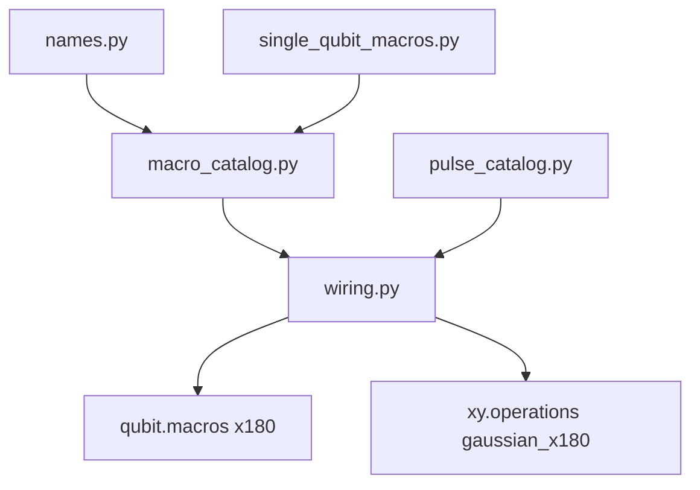
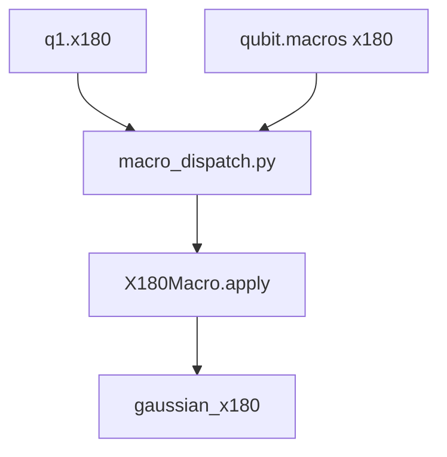

# Quantum Dots Operations and Macro Defaults

This is the guide to the operations and macros on a quantum-dot machine. The rest of the package is introduced in [the quantum-dots overview](../README.md).

A QUA program talks to the machine in the language of the experiment. You initialize a qubit, play a gate, and measure:

```python
q1.initialize()
q1.x180()
q1.measure()
```

Each of those names is a macro already attached to the qubit. Building the machine, and loading a saved one, both run `wire_machine_macros`, so a machine you just built is ready for those calls. You call the qubit. The macro, which is saved with the machine, decides which pulse is played and which voltages are stepped. The amplitude and the length you calibrate are still there the next time you load the machine.

The page has three parts. [Default macros](#default-macros) describes the operations a freshly built machine can already run. [The framework](#the-framework) explains how a name such as `x180` is attached to a macro, and how that macro selects the pulse it plays. [Custom macros](#custom-macros) explains why a lab replaces a default, and how to do it.

## Default macros

The defaults are there so a new machine can run an experiment before the lab writes its own sequences. They cover the voltage moves that prepare and read a dot, the single-qubit gates, and the two-qubit gates that already have a working implementation. `align`, `wait`, and the QPU calls that run a macro on every active component are installed by the catalogs in [The files](#the-files).

### State macros

A state macro moves the gates to a named voltage point, either with a ramp or with a step. `initialize`, `empty`, and `exchange` are that move. `measure` makes the move and then reads the sensor. The classes live in [`default_macros/state_macros.py`](default_macros/state_macros.py).

| Macro | Component | Role                                                                                                                                                                                         |
|-------|-----------|----------------------------------------------------------------------------------------------------------------------------------------------------------------------------------------------|
| **`InitializeStateMacro`**, **`EmptyStateMacro`**, **`ExchangeStateMacro`** | Dots, qubits, and pairs | Move between named voltage points with a ramp or a step.                                                                                                                                     |
| **`MeasurePSBPairMacro`** | `QuantumDotPair`, `LDQubitPair` | Aligns the resonator with the gate channels, steps to the `"measure"` point for `buffer_duration`, then calls the sensor macro.                                                              |
| **`SensorDotMeasureMacro`** | `SensorDot` | Plays the readout pulse. When called with `quantum_dot_pair_id`, it applies the stored threshold, and returns a QUA boolean representing the qubit state. |

Calling `measure` on the QPU runs that same macro on each active qubit, pair, or dot. How the QPU fans the call out is described with the [default catalog](#the-files).

#### Readout

These are the fields a readout calibration writes.

| Parameter | Macro | Notes |
|-----------|-------|-------|
| Measure voltage point | `MeasurePSBPairMacro.point` | Named point or explicit voltage dict |
| Pre-readout buffer | `MeasurePSBPairMacro.buffer_duration` | Hold at the measure point before the RF pulse, in nanoseconds |
| Threshold | `SensorDot.readout_thresholds` | Per pair; assign the dict field directly |
| Integration weights | `SquareReadoutPulse.integration_weights_angle` (on the sensor `"readout"` pulse) | Rotates which IQ axis is used before the I-threshold comparison |
| Pulse name | `SensorDotMeasureMacro.pulse_name` | Default `"readout"`. A pair-specific `"readout_{pair_id}"` is used when that operation is registered |

`MeasurePSBPairMacro.inferred_duration` returns seconds: `(buffer_duration_ns * 1e-9) + sensor_macro.inferred_duration`. The contract is in [voltage_sequence/README.md — Custom Macro Duration Contract](../voltage_sequence/README.md#custom-macro-duration-contract).

The resonator for RF-reflectometry, the threshold, and the pulse setup are covered in [components/README.md](../components/README.md). The pulse catalog in [The files](#the-files) is what places the readout waveform on the sensor.

### Single-qubit macros

A MW-based single qubit gate plays a pulse that already lives on the XY channel. The family in the pulse name is the envelope: `gaussian`, `square`, `kaiser`, `hermite`, or `drag`. Inside a family, two operations store the length and the amplitude you calibrate, `{family}_x90` and `{family}_x180`. Every other XY operation in that family points at one of those two, so editing a stored pulse updates the gates that reference it.

#### Fixed-angle macros

These macros play one stored operation at the amplitude saved on that operation. The rotation is the calibrated pulse, so these calls do not take an `angle`.

`x180` plays `{family}_x180`. `xy_drive` plays that same pulse. `y180` plays `{family}_y180`, and that operation takes its length and amplitude from `{family}_x180`. `x90`, `x_neg90`, `y90`, and `y_neg90` each play their own operation, and those operations take their length and amplitude from `{family}_x90`.

`z90`, `z180`, and `z_neg90` apply a virtual-Z frame rotation of a fixed angle. They do not play an XY pulse, and they do not take an `angle` argument.

#### Canonical rotations

`x(angle)` and `y(angle)` take a rotation of your choosing. `x` plays `{family}_x180` and scales its amplitude by `angle / π`. `y` does the same with `{family}_y180`. If you omit `angle`, the rotation is π, so `x()` is the same gate as `x180` and `y()` is the same gate as `y180`, played at the stored amplitude. A negative angle produces a negative scale, which reverses the rotation.

`z(angle)` applies a virtual-Z frame rotation, and that rotation remains on the element after the call returns. If you omit `angle`, the rotation is π.

#### Parameterizing a single-qubit macro

The gates above are set with four parameters: the rotation `angle`, the amplitude, the duration, and the drive frequency. A value you pass into the call affects only that play. `q1.x(angle=π/2)` and `q1.x180(duration=10)` are examples. `update()` stores a value for later plays. Amplitude and duration are written onto the pulse that the macro plays, and frequency is written onto `qubit.larmor_frequency`. `angle` can be passed to the play only. It is not stored by `update()`.

##### Angle

`angle` is the rotation, in radians. Only `x()` and `y()` accept it. They play the calibrated π pulse, `{family}_x180` or `{family}_y180`, and the scale sent to QUA is `angle / π`. If you omit `angle`, that scale is 1 and the pulse plays at its stored amplitude. A negative angle sends a negative scale. A fixed-angle macro such as `x90` already is a π/2 pulse, so passing `angle` raises `TypeError`.

##### Amplitude

`amplitude_scale` on a play multiplies the amplitude of that one call. The stored pulse is left as it was. On a fixed gate this is how you scale the call, so `q.x90(amplitude_scale=0.5)` plays the calibrated π/2 pulse at half amplitude. On `x` and `y` it multiplies the scale that came from the angle, so `q.x(angle=π/2, amplitude_scale=0.5)` plays the π pulse at a scale of 0.25.

`update(amplitude_scale=...)` multiplies the amplitude stored on the pulse that the macro plays. The next play of that pulse uses the new amplitude.

Power Rabi is the experiment that usually sets the drive amplitude this way.

##### Duration

`apply(duration=...)` on an XY macro, and `I(duration=...)`, count clock cycles. One cycle is 4 ns, the same unit QUA uses for `play(duration=...)` and `wait`. The identity waits 4 cycles by default, which is 16 ns.

`update(duration=...)` writes the pulse length in nanoseconds and rounds it to a multiple of 4 ns. When the field you are writing is a QuAM reference, the call raises `ValueError`, names the operation that stores the value, and writes nothing. `y90.length` references `{family}_x90`, so that duration is changed with `x90.update(duration=...)`. A custom macro whose own pulse stores its length and amplitude can call `update()` on that pulse. Writing that macro is covered in [Custom macros](#custom-macros).

Updating the duration like this is particularly relevant for experiments like time Rabi or T1 for instance.

##### Drive frequency

`update(frequency=...)` writes `qubit.larmor_frequency`. `update(frequency_offset=...)` adds an offset to that same frequency. Passing both in one call stores `frequency`. Every XY gate on the qubit uses that drive frequency.

##### Where a stored value lives

`update()` modifies the parameters of the pulse that the macro you called actually plays. Two pulses in each family hold their own length and amplitude: `{family}_x90` and `{family}_x180`. The other XY pulses point at one of those two, so they share the number instead of storing a second copy. `{family}_y90`, `{family}_y_neg90`, and `{family}_x_neg90` point at `{family}_x90`. `{family}_y180` points at `{family}_x180`.

```python
q1.x90.update(duration=200)     # updates gaussian_x90; y90, y_neg90, and x_neg90 follow
q1.x180.update(duration=400)    # updates gaussian_x180; xy_drive and x() play this pulse
```

`q1.y90.update(duration=200)` targets `gaussian_y90`. That pulse's length is a reference to `gaussian_x90.length`, and writing 200 over it would replace the reference with a separate number. QuAM raises before anything is written:

`ValueError: gaussian_y90.length references gaussian_x90. Update that pulse instead.`

Change the length of `y90` by updating `x90`, the pulse that owns the number. `y180.update(duration=...)` raises in the same way, because `y180` points at `x180`. Amplitude follows the same rule. A custom macro whose played pulse stores its own length and amplitude can call `update()` on that pulse.

Note that this restriction is just a design choice as usually all single qubit gates share the same length. You are however completely free to overwrite the definition of these single qubit macros to better suit your needs.

##### What a calibration writes

These are the fields a calibration writes. The last column is every gate that follows when the field changes.

| Parameter | Where it lives | Affects |
|-----------|---------------|---------|
| x90 amplitude, length, shape | `qubit.xy.operations["gaussian_x90"]` | `x90`, and operations that reference it (`x_neg90`, `y90`, `y_neg90`) |
| x180 amplitude and length | `qubit.xy.operations["gaussian_x180"]` | `x180`, `xy_drive`, `x()`, and `y180` (which references it). `y()` plays `y180` |
| Pulse envelope (family) | `machine.pulse_family` / `set_pulse_family()` | All XY gates |
| Drive frequency | `qubit.larmor_frequency` (`update(frequency=...)`) | All XY gates |
| Voltage points | `qubit.add_point("initialize", {...})` | State macros |

### Two-qubit macros

An `LDQubitPair` is wired with these gates. The first two run. The last three keep the name reserved until your lab supplies a class.

| Name | Default class | Status |
|------|---------------|--------|
| `cz` | `CZMacro` | Exchange-style CZ. It needs calibrated `"exchange"` and detuning points. |
| `crot` | `CROTMacro` | Controlled rotation, implemented with a virtual-Z on both qubits. |
| `cnot`, `swap`, `iswap` | Placeholder macros | Raise at runtime until you supply a lab override. |

`cz` and the state macros on a pair move voltages. They do not play an XY pulse. Replacing one of these names is the recipe in [Using a custom macro in a program](#using-a-custom-macro-in-a-program). [`macro_overrides_example.py`](../examples/macros/macro_overrides_example.py) does it for `cz`. `BalancedDCz2QMacro` is the voltage-balanced form of that gate, compared with the default in [Voltage-balanced macros](#voltage-balanced-macros).

### Calling a macro

`q1.x180` looks up the macro stored under that name. The parentheses run it. For a built-in gate, every form in the table reaches the same `apply()`. Choose the form from whether you are playing a gate, writing a calibration, or calling a gate whose name you do not know yet.

| Call | What you get | Choose it when |
| --- | --- | --- |
| `q1.x180()` | Runs the macro. | You are inside a QUA program and you know the qubit. |
| `q1.x180` with no parentheses | The macro object. `q1.x180.update(...)` writes the stored pulse and does not play. | You are calibrating amplitude, length, or frequency. |
| `q1.macros["x180"]()` | The same macro, looked up by name. `SingleQubitMacroName.X_180` is the same key as `"x180"`. | The name is in a variable, or you want the lookup visible while you configure macros. |
| `q1.macros["x180"].apply()` | Calls `apply()` on the object you already hold. `q1.x180.apply()` is that same call. On the built-in gates, `__call__` only forwards to `apply()`. | You already have the macro in a variable. |
| `operations_registry.x180(q1)` | Checks that the first argument is a qubit, then calls that component's `x180` macro. Importing `x180` from [`default_operations.py`](default_operations.py) is this same function. | The code must run one gate on whatever qubit or pair it was given. |
| `machine.measure()` | Runs `measure` on each active qubit, pair, or dot. | The program should act on the active set. |

```python
from quam_builder.architecture.quantum_dots.operations.default_operations import operations_registry

operations_registry.x180(q1)
operations_registry.measure(pair)
```

`q1.xy.play("gaussian_x180")` plays the waveform on the channel. It skips the macro, including the amplitude scale, the `angle` check, and the sticky-duration update. That call belongs inside a macro you are writing. In an experiment, use one of the calls in the table.


## The framework

A name such as `x180` is defined in a file, matched to a class by a catalog, and stored on the machine by `wire_machine_macros`. The builder and `load()` have already done that for the defaults. This part shows how those files fit together, what each one holds, and the call you use when a name should run a different class.


### How the files work together

The files in this directory divide the work into names, classes, catalogs, and pulses. Nothing here runs by itself. [`wire_machine_macros`](../macro_engine/wiring.py), in the neighboring `macro_engine` package, is the call that reads them and writes the result onto the machine.

The path for one gate is short. [`names.py`](./names.py) defines the string `x180`. [`default_macros/single_qubit_macros.py`](./default_macros/single_qubit_macros.py) defines the class that plays it. [`macro_catalog.py`](./macro_catalog.py) tells the registry that an `LDQubit` should receive that class under that name. [`pulse_catalog.py`](./pulse_catalog.py) builds the waveform the class plays, such as `gaussian_x180`. Wiring stores the macro on `qubit.macros["x180"]` and the pulse on `qubit.xy.operations`.



The call happens later. `q1.x180` looks up `q1.macros["x180"]`, the parentheses run `apply()`, and `apply()` plays `gaussian_x180`. The lookup is in [`macro_dispatch.py`](../components/mixins/macro_dispatch.py). `operations_registry.x180(q1)` is the other way into that same stored macro: it goes through [`default_operations.py`](./default_operations.py) and still ends at `apply()`.



The same path, with different classes, is how `initialize`, `measure`, and `cz` arrive on their components.

### The files

The files below are the ones in that path, in the order a wiring call reads them.

**Names.** [`names.py`](./names.py) is the shared vocabulary. Voltage points, single-qubit macros, two-qubit macros, and pulse families are `StrEnum`s, so the enum member and the string are the same key. Catalogs, overrides, and the pulse builders all use these members. `SingleQubitMacroName.X_180` and `"x180"` select the same macro.

- `VoltagePointName`: `initialize`, `measure`, `empty`, `exchange`, `CZ`
- `SingleQubitMacroName`: the state macros and the gate macros (`xy_drive`, `x`, `y`, `z`, `x180`, `x90`, ...)
- `TwoQubitMacroName`: the state macros and the gate macros (`cnot`, `cz`, `crot`, `swap`, `iswap`)
- `DrivePulseName`: `gaussian`, `square`, `kaiser`, `hermite`, `drag`

**The classes that run.** [`default_macros/`](./default_macros) holds the macros a fresh machine uses.

- [`state_macros.py`](./default_macros/state_macros.py) moves gates to a named voltage point and reads the sensor. `initialize`, `empty`, `exchange`, and `measure` are here.
- [`single_qubit_macros.py`](./default_macros/single_qubit_macros.py) plays the XY gates, the virtual-Z rotations, and the identity.
- [`two_qubit_macros.py`](./default_macros/two_qubit_macros.py) implements `cz` and `crot`, and registers `cnot`, `swap`, and `iswap` as placeholders.

[`utility_macros.py`](./utility_macros.py) defines `align` and `wait`. Every component that can run a macro receives them.

[`voltage_balanced_macros/`](./voltage_balanced_macros) mirrors `default_macros` with three files of the same kind: state, single-qubit, and two-qubit. These classes bring the gates back to 0 V so the integrated voltage on an AC-coupled line cancels. They replace the defaults only when `VoltageBalancedMacroCatalog` is registered.

[`custom_macro.py`](./custom_macro.py) is the base class a lab subclasses. Fields declared on the subclass are saved with the machine, accepted by `update()`, and exposed as a parameter model for Qualibration nodes. The QUA sequence goes in `apply()`.

**How a name is matched to a class.** [`macro_catalog.py`](./macro_catalog.py) does not play gates. It maps a component type to the macro classes above. `wire_machine_macros` asks a `MacroRegistry` for the macro that belongs on each name. The registry merges the catalogs below by priority, and the highest priority wins for each name. A lab catalog is the same kind of object, added beside them.

```
                       ┌──────────────────────────┐
                       │    wire_machine_macros() │   User-facing entry point
                       └─────────┬────────────────┘
                                 │
                    ┌────────────▼────────────┐
                    │     MacroRegistry       │   Aggregates catalogs
                    │  (sorted by priority)   │
                    └────────────┬────────────┘
                                 │
         ┌───────────────────────┼───────────────────────┐
         │                       │                       │
┌────────▼──────────┐  ┌─────────▼──────────┐  ┌─────────▼──────────┐
│UtilityMacroCatalog│  │DefaultMacroCatalog │  │ User Catalog(s)    │
│   priority = 0    │  │  priority = 100    │  │ priority = 200+    │
│ align, wait       │  │ MRO-based defaults │  │ Lab-owned macros   │
└───────────────────┘  └────────────────────┘  └────────────────────┘
```

**`UtilityMacroCatalog`** (priority 0) supplies `align` and `wait` to every component that can run a macro. The classes are in [`utility_macros.py`](./utility_macros.py).

**`DefaultMacroCatalog`** (priority 100) supplies the architecture defaults. It walks the class hierarchy from the base class toward the concrete one. An `LDQubit` therefore receives the state macros of a `QuantumDot` and then its own gate macros, the ones in [Single-qubit macros](#single-qubit-macros). An `LDQubitPair` receives its state macros and the gates in [Two-qubit macros](#two-qubit-macros). A type marked authoritative, such as `SensorDot`, starts from its own map. A `QPU` receives `initialize`, `measure`, and `empty`, and calling one of them runs that macro on each active qubit, pair, or dot.

**`VoltageBalancedMacroCatalog`** replaces the default state macros with zero-integral variants for AC-coupled lines. What those variants do, compared with the defaults, is [Voltage-balanced macros](#voltage-balanced-macros).

**`TypeOverrideCatalog`** is a catalog you can build in the experiment file when the override is only a few lines. It matches the component type exactly. The call is in [Changing a macro](#changing-a-macro).

A lab catalog uses priority 200 or higher, so it wins over the architecture default for any name it defines. Adding one is [Adding a new set of macros](#adding-a-new-set-of-macros).

**The pulses those classes play.** [`pulse_catalog.py`](./pulse_catalog.py) builds the default waveforms. The same `wire_machine_macros` call installs them through `PulseWirer`. Pulse wiring only adds a name that is not already on the channel, so a waveform you have edited survives a later wiring call. State macros and `cz` move voltages, so they do not use these pulses. The XY and readout macros look the waveform up by name when they play. Which of those pulses a gate plays, and which one `update()` writes, is [Where a stored value lives](#where-a-stored-value-lives).

Five families are loaded on each qubit: Gaussian, Square, Kaiser, Hermite, and DRAG. The operation name is `{family}_{gate}`, for example `"gaussian_x90"` or `"drag_x180"`. The default length is 1000 ns. The x90 amplitude is 0.25, and the x180 amplitude is twice that. A `SingleChannel` pulse has `axis_angle=None`, so the X and Y waveforms are the same real trace. An IQ or MW pulse stores its own `axis_angle`. `machine.pulse_family`, or `machine.set_pulse_family(...)`, chooses which family the XY macros play.

Each sensor-dot resonator receives a `SquareReadoutPulse` named `"readout"`, with length 2000 ns and amplitude 1.0. [Readout](#readout) is the macro that plays it.

**A second way to call the same macros.** [`default_operations.py`](./default_operations.py) registers `x180`, `measure`, and the other names on `OperationsRegistry`. `operations_registry.x180(q1)` ends in `q1.macros["x180"].apply()`. It is the entry point for code that has a component and a name, rather than a specific qubit class. The forms you choose among are in [Calling a macro](#calling-a-macro).

### Changing a macro

The builder has already wired the machine. You call `wire_machine_macros` when a name should run a different class.

```python
from quam_builder.architecture.quantum_dots.macro_engine import wire_machine_macros

wire_machine_macros(machine)
```

With no extra arguments, that call adds any macro name that is still missing and leaves a macro that is already there in place. `load()` uses this so a calibration saved in the state file stays on the component.

When several sources define the same name, they are applied in this order. The last source is the macro stored on the component. What each catalog contains is described under [The files](#the-files).

1. `UtilityMacroCatalog` (priority 0) supplies `align` and `wait`.
2. `DefaultMacroCatalog` (priority 100) supplies the architecture defaults.
3. User catalogs (priority 200 and above), including `TypeOverrideCatalog` and a lab package, replace those defaults for the names they define.
4. Instance overrides are applied last, and they name one component path.

A catalog replaces a macro that is already on the component when `fill_only=False`. With the default `fill_only=True`, the catalog adds names that are absent. An instance override replaces the existing macro even when `fill_only` stays `True`.

**Every component of a type.** Pass a catalog and set `fill_only=False`:

```python
from my_lab_macros.catalog import LabMacroCatalog

wire_machine_macros(
    machine,
    catalogs=[LabMacroCatalog()],
    fill_only=False,
)
```

**A few lines in the experiment file.** `TypeOverrideCatalog` is that same catalog, written next to the script. It matches the component type exactly. On a machine that already has the defaults, pass `fill_only=False`:

```python
from functools import partial
from quam_builder.architecture.quantum_dots.macro_engine import wire_machine_macros
from quam_builder.architecture.quantum_dots.operations.macro_catalog import TypeOverrideCatalog
from quam_builder.architecture.quantum_dots.operations.names import SingleQubitMacroName
from quam_builder.architecture.quantum_dots.qubit import LDQubit

wire_machine_macros(
    machine,
    fill_only=False,
    catalogs=[
        TypeOverrideCatalog({
            LDQubit: {
                SingleQubitMacroName.INITIALIZE: partial(InitMacro, ramp_duration=64),
            },
        }),
    ],
)
```

**One component.** An instance override changes that component and leaves the others on the default. The path names one object on the machine: `qpu`, `qubits.q1`, `qubit_pairs.q1_q2`, `quantum_dots.dot_1`, `quantum_dot_pairs.dot_1_dot_2`, `sensor_dots.s1`, `barrier_gates.b12`, `global_gates.g1`. The path has to point at a component that has a `macros` mapping.

```python
from quam_builder.architecture.quantum_dots.operations.names import SingleQubitMacroName

wire_machine_macros(
    machine,
    instance_overrides={
        "qubits.q1": {
            SingleQubitMacroName.X_180: TunedX180Macro,
        },
    },
)
```

`DISABLED` removes a name from that one component. The path and the name both have to exist.

```python
from quam_builder.architecture.quantum_dots.macro_engine import DISABLED

wire_machine_macros(
    machine,
    instance_overrides={
        "qubit_pairs.q1_q2": {
            TwoQubitMacroName.CZ: DISABLED,
        },
    },
)
```

A path that matches nothing, such as `"qubits.q99"`, and `DISABLED` aimed at a macro that is not on the component, raise `KeyError`. The wiring call fails before the QUA program is compiled.

If the override should be part of construction, pass `catalogs` and `instance_overrides` to `build_base_quam()`, `build_loss_divincenzo_quam()`, or `build_quam()`. Those builders forward the arguments into the same wiring step.

A catalog is any object with an integer `priority` and a `get_factories(component_type)` method that returns a `MacroFactoryMap`. The registry calls that method once per component type. Return an empty map for types your lab does not customize. Each value in the map is a factory. Wiring calls it with no arguments to build the macro that gets stored on the component.

- A `QuamMacro` subclass is called with no arguments.
- A zero-argument callable may return a `QuamMacro`. `functools.partial(InitMacro, ramp_duration=64)` stores a calibrated default in the factory.

The file that puts this class in its own package is [Adding a new set of macros](#adding-a-new-set-of-macros).

## Custom macros

A default macro is the sequence the architecture ships. A lab replaces it when the device needs a different voltage trajectory, a gate the placeholder does not implement, or a pulse that stores its own length and amplitude. The rules for attaching that class are [Changing a macro](#changing-a-macro).

### Using a custom macro in a program

Subclass the macro, register it on the machine with one of the calls above, and call it the same way as a default. `inferred_duration` is in seconds, so sticky-voltage tracking can add the hold. The contract is in [voltage_sequence/README.md — Custom Macro Duration Contract](../voltage_sequence/README.md#custom-macro-duration-contract).

[`macro_overrides_example.py`](../examples/macros/macro_overrides_example.py) replaces a default with a catalog and with an instance override, then writes a calibrated value with `update(...)`. [`external_macro_package_example.py`](../examples/macros/external_macro_package_example.py) loads the catalog from a package next to the script. [`macro_defaults_example.py`](../examples/macros/macro_defaults_example.py) stays on the defaults and only changes a stored amplitude and `I.duration`.

### Voltage-balanced macros

On an AC-coupled gate line, a default state macro that steps away from zero and never returns leaves a nonzero integrated voltage on the line. `VoltageBalancedMacroCatalog` replaces those state macros with variants whose positive and negative segments cancel, so the net integral on each channel is zero. The defaults in [State macros](#state-macros) do not add that return segment.

The conventions, implemented in [`voltage_balanced_macros/state_macros.py`](voltage_balanced_macros/state_macros.py), are:

- The `initialize` point is 0 V on every channel. The macro treats it as the rest state and does not travel to it.
- The `empty` and `measure` points store the positive-polarity targets. The matching negative segments are derived when the macro runs.
- Each macro starts at 0 V and ends at 0 V, with zero net ∫V·dt per channel.

Register the catalog with `fill_only=False`, as in [Changing a macro](#changing-a-macro), so it replaces the state macros the builder already installed:

```python
from quam_builder.architecture.quantum_dots.operations.macro_catalog import VoltageBalancedMacroCatalog
from quam_builder.architecture.quantum_dots.macro_engine import wire_machine_macros

wire_machine_macros(
    machine,
    catalogs=[VoltageBalancedMacroCatalog()],
    fill_only=False,
)
```

The classes you are most likely to import are `BalancedInitializeMacro`, `BalancedHeraldedInitializeMacro`, `BalancedEmptyMacro`, `BalancedMeasurePSBPairMacro`, `BalancedDCz2QMacro`, and `TwoStageBalancedInitializeMacro`. They import from the package the same way as [`default_macros`](default_macros/__init__.py):

```python
from quam_builder.architecture.quantum_dots.operations.voltage_balanced_macros import (
    BalancedDCz2QMacro,
    BalancedHeraldedInitializeMacro,
)
```

### Adding a new set of macros

Keep the catalog outside this repository, in a small package that your experiment scripts import. An upstream update of quam-builder then leaves your macros where they are.

```python
# my_lab_macros/catalog.py
from quam_builder.architecture.quantum_dots.operations.macro_catalog import MacroFactoryMap
from quam_builder.architecture.quantum_dots.operations.names import SingleQubitMacroName

class LabMacroCatalog:
    priority = 200

    def get_factories(self, component_type: type) -> MacroFactoryMap:
        from quam_builder.architecture.quantum_dots.qubit import LDQubit
        if issubclass(component_type, LDQubit):
            return {
                SingleQubitMacroName.INITIALIZE: LabInitMacro,
                SingleQubitMacroName.X: LabXMacro,
            }
        return {}
```

At the experiment, pass that catalog in and allow it to replace the defaults the machine already has:

```python
from my_lab_macros.catalog import LabMacroCatalog
from quam_builder.architecture.quantum_dots.macro_engine import wire_machine_macros

wire_machine_macros(
    machine,
    catalogs=[LabMacroCatalog()],
    fill_only=False,
)
```

## Examples

The scripts under [`../examples/macros/`](../examples/macros/) run this page on the tutorial machine.

- [`macro_defaults_example.py`](../examples/macros/macro_defaults_example.py) uses the macros the machine already has, sets the stored `gaussian_x90` amplitude and `I.duration`, and prints the QUA program.
- [`macro_overrides_example.py`](../examples/macros/macro_overrides_example.py) replaces a default with a catalog and with an instance override, then writes a calibrated value with `update(...)`.
- [`pulse_overrides_example.py`](../examples/macros/pulse_overrides_example.py) edits the stored `x90` and `x180` pulses and switches the pulse family.
- [`external_macro_package_example.py`](../examples/macros/external_macro_package_example.py) loads a catalog from a tiny package next to the script.
