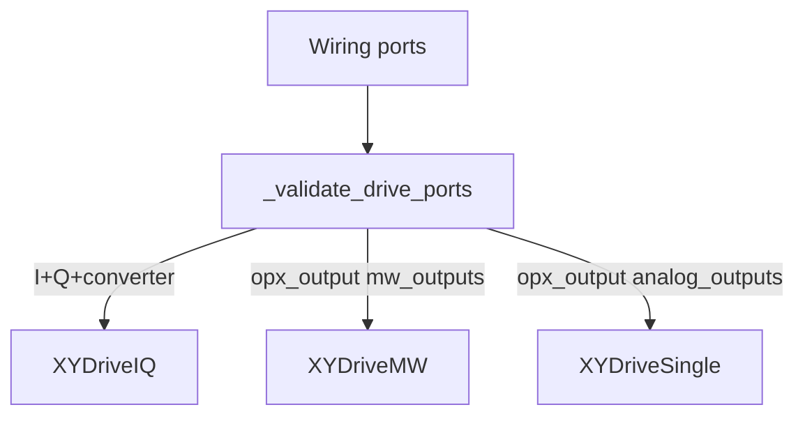

> This document is the detailed guide for Loss DiVincenzo and spin-qubit quam. For an overview of all quantum-dot QuAM components, operations, and macros, see [../README.md](../README.md).

# Loss DiVincenzo and spin-qubit QuAM

This document covers the **spin-qubit layer** built on top of the quantum-dot architecture: the QuAM root types that register qubits and pairs, microwave **XY** control lines, and how they connect to underlying `QuantumDot` objects and voltage sequencing.

For DC gates, virtual gates, and `VoltageSequence`, see the parent [quantum-dot architecture README](../README.md) and [voltage_sequence/README.md](../voltage_sequence/README.md). For default macros, pulses, and overrides, see [operations/README.md](../operations/README.md).

## `BaseQuamQD` vs `LossDiVincenzoQuam`

- **`BaseQuamQD`** ([`base_quam_qd.py`](base_quam_qd.py)) — QuAM root focused on **quantum-dot device layout**: `quantum_dots`, `sensor_dots`, `barrier_gates`, `quantum_dot_pairs`, `virtual_gate_sets`, `voltage_sequences`, global gates, Octave/mixer metadata, and helpers to create gate sets and register dots. Use it when calibrating and operating the **underlying dots** without a full spin-qubit abstraction.

- **`LossDiVincenzoQuam`** ([`loss_divincenzo_quam.py`](loss_divincenzo_quam.py)) — Extends `BaseQuamQD` with **Loss DiVincenzo–style spin qubits**: `qubits`, `qubit_pairs`, `b_field`, `active_qubit_names`, and `active_qubit_pair_names`. It is the usual root when you calibrate and run **ESR/EDSR** experiments and two-qubit gates on top of the same dot connectivity. `load()` upgrades a deserialized `BaseQuamQD` instance to this class when appropriate and runs `wire_machine_macros`.

## `LossDiVincenzoQuam` surface

Notable attributes and behaviour (see class docstring for the full list):

- **`qubits`** — `Dict[str, AnySpinQubit]`; **`LDQubit`** instances keyed by name.
- **`qubit_pairs`** — `Dict[str, AnySpinQubitPair]` (e.g. **`LDQubitPair`**) for two-qubit control.
- **`b_field`** — Operating external magnetic field (device metadata).
- **`active_qubit_names`**, **`active_qubit_pair_names`** — Subsets used when broadcasting QPU-level routines.
- **`register_qubit`**, **`register_qubit_pair`** — Construct qubit / pair objects from existing `QuantumDot` (and pair) topology.
- **`get_component`** — Resolves names across qubits, pairs, dots, sensors, barriers, etc.

## `LDQubit` ([`../qubit/ld_qubit.py`](../qubit/ld_qubit.py))

A Loss DiVincenzo qubit ties a **`QuantumDot`** (plunger / voltage sequence) to microwave control and readout-oriented fields:

- **`quantum_dot`** — The physical dot; voltage macros (`step_to_point`, `add_point`, …) are delegated through the dot’s `VoltageSequence`.
- **`xy`** — Optional **`XYDriveBase`** subclass for EDSR/ESR drive lines; see [XY drive components](#xy-drive-components) below.
- **Coherence and reset** — `T1`, `T2ramsey`, `T2echo`, `thermalization_time_factor`, `reset`, and **`calibrate_octave`** for drive.
- **Macros** — Inherits **`VoltageMacroMixin`** with QuAM `Qubit`; default single-qubit gates and state macros are wired via [`operations/`](../operations/) and **`wire_machine_macros`**.

## `LDQubitPair` ([`../qubit_pair/ld_qubit_pair.py`](../qubit_pair/ld_qubit_pair.py))

Pairs two **`LDQubit`** instances for two-qubit primitives; default two-qubit macros (`cnot`, `cz`, …) are registered the same way as for `LDQubit`, with placeholders until you supply calibration overrides (see [operations/README.md](../operations/README.md)).

## XY drive components ([`../components/xy_drive.py`](../components/xy_drive.py))

All three concrete drive types inherit **`XYDriveBase`** and are composed on **`LDQubit.xy`**. They differ by **QuAM channel type** and **hardware wiring**, not by macro API — single-qubit gates still go through `XYDriveMacro` and default pulses from [`component_pulse_catalog`](../operations/component_pulse_catalog.py).

| Variant | QuAM base | Typical hardware | Required ports | IF / LO |
|---------|-----------|------------------|----------------|---------|
| **`XYDriveSingle`** | `SingleChannel` | **LF-FEM / OPX+** baseband analog output | single `opx_output` → `analog_outputs` | Required `RF_frequency` (aliases `intermediate_frequency`) |
| **`XYDriveIQ`** | `IQChannel` | **LF-FEM / OPX+ + Octave or external mixer** | `opx_output_I`, `opx_output_Q`, `frequency_converter_up` | `intermediate_frequency` + `LO_frequency` via `upconverter_frequency` |
| **`XYDriveMW`** | `MWChannel` | **MW-FEM** direct microwave output | single `opx_output` → `mw_outputs` | `intermediate_frequency` + upconverter on port (`upconverter_frequency` from `opx_output`) |

**`XYDriveBase`** provides shared helpers (e.g. `calculate_voltage_scaling_factor` for scaling between dBm levels).

### `XYDriveSingle`

- Baseband EDSR/ESR on a **single** LF-FEM analog port — no external upconversion.
- Simplest setup; `RF_frequency` is the drive IF.
- Pulses use **real-valued waveforms** (`axis_angle=None`); rotation axis is handled by **virtual-Z** in `XYDriveMacro`, not hardware IQ mixing.
- No built-in `get_output_power` / `set_output_power` (only shared `XYDriveBase.calculate_voltage_scaling_factor`).

### `XYDriveIQ`

- Preferred when wiring exposes **I/Q outputs and a frequency converter** (Octave path).
- **Hardware IQ mixing** — default reference pulse gets `axis_angle=0.0`; macro applies virtual-Z for X/Y axis selection (same macro path as MW).
- Power helpers: `get_output_power` / `set_output_power` via IQ gain/amplitude ([`power_tools.py`](../../../tools/power_tools.py)).
- Builder note: preferred for LF-FEM RF allocation when IQ ports are available (see `_create_xy_drive_from_wiring` in [`build_utils.py`](../../../builder/quantum_dots/build_utils.py)).

### `XYDriveMW`

- For **MW-FEM** setups (examples: [`quam_ld_generator_example.py`](../examples/quam_ld_generator_example.py), [`rabi_chevron.py`](../examples/rabi_chevron.py)).
- Single MW port with on-module upconversion; IF + port upconverter frequency define the emitted tone.
- Same pulse/macro model as IQ (`axis_angle=0.0`).
- Power helpers via MW full-scale power ([`power_tools.py`](../../../tools/power_tools.py)).

### `XYDrive` Parallel execution

For all types of XYDrive, it is important to note that they are by default running in parallel to `VirtualGateSet / VoltageSequence` operations and other XYDrive components. This has implications on the user managing timings of these pulses.

### Builder auto-detection

When you use [`build_loss_divincenzo_quam`](../../../builder/quantum_dots/) (or stage-2 wiring), `_validate_drive_ports` in [`build_utils.py`](../../../builder/quantum_dots/build_utils.py) picks the variant from port keys and reference paths:



Pulse factories for XY are registered in the operations layer (`component_pulse_catalog`, default pulses for `LDQubit`) via **`wire_machine_macros`**.

## Macros and wiring

Spin qubits use the same **macro engine** as the rest of the architecture: `LossDiVincenzoQuam.load()` calls **`wire_machine_macros`**. Default macro maps for `LDQubit` and `LDQubitPair` (state macros, `xy_drive`, `x180`, two-qubit names, …) live under [`../operations/default_macros/`](../operations/default_macros/). Invocation patterns are described in [operations/README.md](../operations/README.md).

## Builder and examples

- **Builder** — [`quam_builder.builder.quantum_dots`](../../../builder/quantum_dots/) exposes `build_loss_divincenzo_quam` (and staged builders) to materialize a full `LossDiVincenzoQuam` from connectivity specs.
- **Examples** — [`../examples/quam_ld_example.py`](../examples/quam_ld_example.py), [`../examples/quam_ld_generator_example.py`](../examples/quam_ld_generator_example.py), [`../examples/rabi_chevron.py`](../examples/rabi_chevron.py), [`../examples/rabi_chevron_transport.py`](../examples/rabi_chevron_transport.py).

## Tests

Spin-qubit and QPU tests live under [`tests/architecture/quantum_dots/components/`](../../../../tests/architecture/quantum_dots/components/) (e.g. `test_ld_qubit.py`, `test_ld_qubit_pair.py`, `test_base_quam_qd.py`).

## Import cheat sheet

```python
from quam_builder.architecture.quantum_dots.qpu import LossDiVincenzoQuam, BaseQuamQD
from quam_builder.architecture.quantum_dots.qubit import LDQubit
from quam_builder.architecture.quantum_dots.qubit_pair import LDQubitPair
from quam_builder.architecture.quantum_dots.components import (
    XYDriveSingle,
    XYDriveIQ,
    XYDriveMW,
)
```
