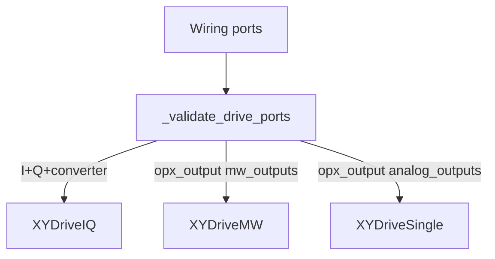

> This document is the detailed guide for Loss DiVincenzo and spin-qubit quam. For an overview of all quantum-dot QuAM components, operations, and macros, see [../README.md](../README.md).

# Loss DiVincenzo and spin-qubit QuAM

This document covers the **spin-qubit layer** built on top of the quantum-dot architecture: the QuAM root types that register qubits and pairs, microwave **XY** control lines, and how they connect to underlying `QuantumDot` objects and voltage sequencing.

For DC gates, virtual gates, and `VoltageSequence`, see the parent [quantum-dot architecture README](../README.md) and [voltage_sequence/README.md](../voltage_sequence/README.md). For default macros, pulses, and overrides, see [operations/README.md](../operations/README.md). For readout and pulse shapes, see [components/README.md](../components/README.md).

## `BaseQuamQD` machine settings

These fields on **`BaseQuamQD`** (and inherited by **`LossDiVincenzoQuam`**) are machine-level settings. `track_integrated_voltage` and `limit_play_commands` are passed into sequences created by `get_voltage_sequence()` (and similar machine helpers). Direct `gate_set.new_sequence()` uses `GateSet` defaults instead (`enforce_qua_calcs=True`; `track_integrated_voltage` / `limit_play_commands` default `False`):

| Field | Default | Purpose |
|-------|---------|---------|
| **`pulse_family`** | `"gaussian"` | Active XY pulse envelope for all qubits (`gaussian`, `square`, `kaiser`, `hermite`, `drag`). |
| **`set_pulse_family(family)`** | — | Updates `pulse_family` and every qubit XY macro's `pulse_family` field. |
| **`track_integrated_voltage`** | `False` | When `True`, new voltage sequences track ∫V·dt for `apply_compensation_pulse()`. |
| **`limit_play_commands`** | `False` | When `True`, voltage sequences only emit `play`/`ramp` on physical channels affected by changed gates (requires `influence_map` on the gate set). |

```python
machine.track_integrated_voltage = True
machine.limit_play_commands = True
machine.set_pulse_family("drag")
```

See [voltage_sequence/README.md](../voltage_sequence/README.md) for sequence parameters and [operations/README.md](../operations/README.md) for pulse wiring.

## `BaseQuamQD` vs `LossDiVincenzoQuam`

- **`BaseQuamQD`** ([`base_quam_qd.py`](base_quam_qd.py)) — QuAM root focused on **quantum-dot device layout**: `quantum_dots`, `sensor_dots`, `barrier_gates`, `quantum_dot_pairs`, `virtual_gate_sets`, `voltage_sequences`, global gates, Octave/mixer metadata, and helpers to create gate sets and register dots. Use it when calibrating and operating the **underlying dots** without a full spin-qubit abstraction.

- **`LossDiVincenzoQuam`** ([`loss_divincenzo_quam.py`](loss_divincenzo_quam.py)) — Extends `BaseQuamQD` with **Loss DiVincenzo–style spin qubits**: `qubits`, `qubit_pairs`, `b_field`, `active_qubit_names`, and `active_qubit_pair_names`. It is the usual root when you calibrate and run **ESR/EDSR** experiments and two-qubit gates on top of the same dot connectivity. `load()` upgrades a deserialized `BaseQuamQD` instance to this class when appropriate and runs `wire_machine_macros`.

## `LossDiVincenzoQuam` surface

Notable attributes and behaviour (see class docstring for the full list):

- **`qubits`** — `Dict[str, AnySpinQubit]`; **`LDQubit`** instances keyed by name.
- **`qubit_pairs`** — `Dict[str, AnySpinQubitPair]` (e.g. **`LDQubitPair`**) for two-qubit control.
- **`b_field`** — Operating external magnetic field (device metadata).
- **`active_qubit_names`**, **`active_qubit_pair_names`** — Subsets used when broadcasting QPU-level routines.
- **`register_qubit`**, **`register_qubit_pair`** — Construct qubit / pair objects from existing `QuantumDot` (and pair) topology.
- **`get_component`** — Resolves names across qubits, pairs, dots, sensors, barriers, etc.

## `LDQubit` ([`../qubit/ld_qubit.py`](../qubit/ld_qubit.py))

A Loss DiVincenzo qubit ties a **`QuantumDot`** (plunger / voltage sequence) to microwave control and readout-oriented fields:

- **`quantum_dot`** — The physical dot; voltage macros (`step_to_point`, `add_point`, …) are delegated through the dot’s `VoltageSequence`.
- **`xy`** — Optional **`XYDriveBase`** subclass for EDSR/ESR drive lines; see [XY drive components](#xy-drive-components) below.
- **Coherence and reset** — `T1`, `T2ramsey`, `T2echo`, `thermalization_time_factor`, `reset`, and **`calibrate_octave`** for drive.
- **Macros** — Inherits **`VoltageMacroMixin`** with QuAM `Qubit`; default single-qubit gates and state macros are wired via [`operations/`](../operations/) and **`wire_machine_macros`**.

## `LDQubitPair` ([`../qubit_pair/ld_qubit_pair.py`](../qubit_pair/ld_qubit_pair.py))

Pairs two **`LDQubit`** instances for two-qubit primitives; default two-qubit macros are registered the same way as for `LDQubit`. `cz` (`CZMacro`) and `crot` (`CROTMacro`) are implemented; `cnot`, `swap`, and `iswap` are placeholders until you supply calibration overrides (see [operations/README.md](../operations/README.md)).

## XY drive components ([`../components/xy_drive.py`](../components/xy_drive.py))

All three concrete drive types inherit **`XYDriveBase`** and are composed on **`LDQubit.xy`**. They differ by **QuAM channel type** and **hardware wiring**, not by macro API — single-qubit gates still go through `XYDriveMacro` and default pulses from [`pulse_catalog.py`](../operations/pulse_catalog.py).

| Variant | QuAM base | Typical hardware | Required ports | IF / LO |
|---------|-----------|------------------|----------------|---------|
| **`XYDriveSingle`** | `SingleChannel` | **LF-FEM / OPX+** baseband analog output | single `opx_output` → `analog_outputs` | Required `RF_frequency` (aliases `intermediate_frequency`) |
| **`XYDriveIQ`** | `IQChannel` | **LF-FEM / OPX+ + Octave or external mixer** | `opx_output_I`, `opx_output_Q`, `frequency_converter_up` | `intermediate_frequency` + `LO_frequency` via `upconverter_frequency` |
| **`XYDriveMW`** | `MWChannel` | **MW-FEM** direct microwave output | single `opx_output` → `mw_outputs` | `intermediate_frequency` + upconverter on port (`upconverter_frequency` from `opx_output`) |

**`XYDriveBase`** provides shared helpers (e.g. `calculate_voltage_scaling_factor` for scaling between dBm levels).

### `XYDriveSingle`

- Baseband EDSR/ESR on a **single** LF-FEM analog port — no external upconversion.
- Simplest setup; `RF_frequency` is the drive IF.
- Pulses use **real-valued waveforms** (`axis_angle=None`); rotation axis is handled by **virtual-Z** in `XYDriveMacro`, not hardware IQ mixing.
- No built-in `get_output_power` / `set_output_power` (only shared `XYDriveBase.calculate_voltage_scaling_factor`).

### `XYDriveIQ`

- Preferred when wiring exposes **I/Q outputs and a frequency converter** (Octave path).
- **Hardware IQ mixing** — default reference pulse gets `axis_angle=0.0`; macro applies virtual-Z for X/Y axis selection (same macro path as MW).
- Power helpers: `get_output_power` / `set_output_power` via IQ gain/amplitude ([`power_tools.py`](../../../tools/power_tools.py)).
- Builder note: preferred for LF-FEM RF allocation when IQ ports are available (see `_create_xy_drive_from_wiring` in [`build_utils.py`](../../../builder/quantum_dots/build_utils.py)).

### `XYDriveMW`

- For **MW-FEM** setups (examples: [`quam_ld_generator_example.py`](../examples/quam_ld_generator_example.py), [`rabi_chevron.py`](../examples/rabi_chevron.py)).
- Single MW port with on-module upconversion; IF + port upconverter frequency define the emitted tone.
- Same pulse/macro model as IQ (`axis_angle=0.0`).
- Power helpers via MW full-scale power ([`power_tools.py`](../../../tools/power_tools.py)).

### `XYDrive` parallel execution and timing

XY drive elements and sticky voltage gates are **independent QUA channels**. A call like `qubit.x180()` plays on the XY element while `VoltageSequence` operations on plungers/barriers run on their own timeline unless you synchronize them.

**Recommended patterns:**

1. **`qua.align(...)`** — before or after combining XY pulses with voltage moves or readout (see [`full_workflow_example.py`](../examples/full_workflow_example.py), [`dcz_macro_example.py`](../examples/dcz_macro_example.py)).
2. **`qubit.idle(duration)`** — waits on both the dot plunger and XY channel in cycles (4 ns units).
3. **Macro `inferred_duration`** — custom macros that hold non-zero DC during XY or readout should expose `inferred_duration` (seconds) so integrated-voltage tracking stays correct. See [voltage_sequence/README.md — Custom Macro Duration Contract](../voltage_sequence/README.md#custom-macro-duration-contract).

```python
from qm import qua

with program() as prog:
    q1.initialize()
    qua.align(q1.xy.name, q1.quantum_dot.physical_channel.name)
    q1.x180()
    qua.align(q1.xy.name, machine.sensor_dots["s1"].readout_resonator.name)
    q1.measure()
```

### IQ / MW setup checklist

When wiring **`XYDriveIQ`** or **`XYDriveMW`**, ensure the QuAM tree includes:

| Field | IQ | MW |
|-------|----|----|
| Drive ports | `opx_output_I`, `opx_output_Q` | `opx_output` → `mw_outputs` |
| Upconversion | `frequency_converter_up` (Octave) | Port `upconverter_frequency` |
| LO | `LO_frequency` / `upconverter_frequency` | From MW port metadata |
| IF | `intermediate_frequency` (often `#./inferred_intermediate_frequency`) | Same |
| Larmor link | `RF_frequency: "#../larmor_frequency"` on IQ | MW uses qubit `larmor_frequency` refs |

After building the machine:

```python
QM = QuantumMachinesManager(...).open_qm(machine.generate_config())
machine.calibrate_octave_ports(QM)  # LossDiVincenzoQuam: all active qubits
# or per qubit:
q1.calibrate_octave(QM, calibrate_drive=True)
```

Octave calibration sets mixer skew and LO/IF for the drive (and optionally readout) element.

### NCO and frequency planning

Emitted tone ≈ **LO + IF** (sign convention per channel type). The qubit's **`larmor_frequency`** is the physical ESR/EDSR target; the builder infers IF from LO choices.

**IF limits** (validated in `XYDriveBase.validate_intermediate_frequency`):

- **LF-FEM / IQ (`XYDriveSingle`, `XYDriveIQ`):** |IF| ≤ **400 MHz**
- **MW-FEM (`XYDriveMW`):** |IF| ≤ **500 MHz**

If validation fails, adjust `LO_frequency` or `larmor_frequency` so the required IF falls within band.

### Phase control model

Single-qubit XY rotations use a **reference pulse** (default `{pulse_family}_x180`) as the amplitude/phase source of truth:

| Drive type | Waveform | Axis selection |
|------------|----------|----------------|
| **`XYDriveSingle`** | Real baseband (`axis_angle=None`) | Virtual-Z frame rotation (`qubit.virtual_z`) before/after `play` |
| **`XYDriveIQ` / `XYDriveMW`** | Complex envelope (`axis_angle=0.0` on reference) | Same virtual-Z path; hardware IQ mixer carries the tone |

The macro chain (`x180` → `x` → `xy_drive`) applies `virtual_z(phase)` to select X, Y, or arbitrary XY axes without redefining pulse waveforms. This is the primary **phase correction** mechanism at the experiment layer; Octave **`calibrate_octave`** handles mixer/LO calibration at the hardware layer.

Overriding **`reference_angle`** or the reference pulse amplitude rescales all fixed-angle gates. See [operations/README.md](../operations/README.md#single-qubit-gate-composition-model).

### Builder auto-detection

When you use [`build_loss_divincenzo_quam`](../../../builder/quantum_dots/) (or stage-2 wiring), `_validate_drive_ports` in [`build_utils.py`](../../../builder/quantum_dots/build_utils.py) picks the variant from port keys and reference paths:


```mermaid
flowchart TD
  wiring[Wiring ports] --> validate[_validate_drive_ports]
  validate -->|I+Q+converter| IQ[XYDriveIQ]
  validate -->|opx_output mw_outputs| MW[XYDriveMW]
  validate -->|opx_output analog_outputs| Single[XYDriveSingle]
```

Pulse factories for XY are registered in the operations layer ([`pulse_catalog.py`](../operations/pulse_catalog.py), default pulses for `LDQubit`) via **`wire_machine_macros`**.

## Macros and wiring

Spin qubits use the same **macro engine** as the rest of the architecture: `LossDiVincenzoQuam.load()` calls **`wire_machine_macros`**. Default macro maps for `LDQubit` and `LDQubitPair` (state macros, `xy_drive`, `x180`, two-qubit names, …) live under [`../operations/default_macros/`](../operations/default_macros/). Invocation patterns are described in [operations/README.md](../operations/README.md).

## Builder and examples

- **Builder** — [`quam_builder.builder.quantum_dots`](../../../builder/quantum_dots/) exposes `build_loss_divincenzo_quam` (and staged builders) to materialize a full `LossDiVincenzoQuam` from connectivity specs.
- **Examples** — [`../examples/quam_ld_example.py`](../examples/quam_ld_example.py), [`../examples/quam_ld_generator_example.py`](../examples/quam_ld_generator_example.py), [`../examples/rabi_chevron.py`](../examples/rabi_chevron.py), [`../examples/rabi_chevron_transport.py`](../examples/rabi_chevron_transport.py).

## Tests

Spin-qubit and QPU tests live under [`tests/architecture/quantum_dots/components/`](../../../../tests/architecture/quantum_dots/components/) (e.g. `test_ld_qubit.py`, `test_ld_qubit_pair.py`, `test_base_quam_qd.py`).

## Import cheat sheet

```python
from quam_builder.architecture.quantum_dots.qpu import LossDiVincenzoQuam, BaseQuamQD
from quam_builder.architecture.quantum_dots.qubit import LDQubit
from quam_builder.architecture.quantum_dots.qubit_pair import LDQubitPair
from quam_builder.architecture.quantum_dots.components import (
    XYDriveSingle,
    XYDriveIQ,
    XYDriveMW,
)
```
