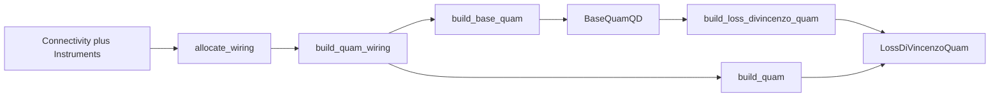

# Quantum-dot QuAM builder

This package (`quam_builder.builder.quantum_dots`) turns **connectivity / wiring** into a serialized QuAM tree: sticky `VoltageGate` channels, a virtual gate set, dots and sensors, then (optionally) Loss-DiVincenzo qubits and XY drives.

Architecture classes, macros, and voltage sequences live under [`quam_builder.architecture.quantum_dots`](../../architecture/quantum_dots/README.md). This document is only the **build path**.

**Typical first program after a build:** [`tutorial_machine.py`](../../architecture/quantum_dots/examples/tutorial_machine.py) (`build_tutorial_machine()` already calls `build_quam` + `wire_machine_macros`).

## When to use which entry point

| Function | Produces | Use when |
|----------|----------|----------|
| **`build_quam`** | `LossDiVincenzoQuam` | Combined workflow: wiring already includes plungers, barriers, sensors, and drive lines. |
| **`build_base_quam`** | `BaseQuamQD` | Stage 1: calibrate **dots and gates** before adding spin qubits. |
| **`build_loss_divincenzo_quam`** | `LossDiVincenzoQuam` | Stage 2: add `LDQubit` / `LDQubitPair` / XY drives on an existing dot machine (in memory or from a saved state). |

All three call **`wire_machine_macros`**, so default macros and pulses exist on the returned machine. Pass `catalogs` and `instance_overrides` the same way as in [operations/README.md](../../architecture/quantum_dots/operations/README.md).

Pair with [`build_quam_wiring`](../qop_connectivity/) so logical elements map to controller ports **before** these builders run.

Default virtual gate set id is **`main_qpu`** (`DEFAULT_GATE_SET_ID` in [`build_utils.py`](build_utils.py)).



## Combined workflow

Define connectivity (including drive lines), allocate, write wiring, then `build_quam`:

```python
from qualang_tools.wirer import Connectivity, Instruments, allocate_wiring
from quam_builder.architecture.quantum_dots.qpu import BaseQuamQD
from quam_builder.builder.qop_connectivity import build_quam_wiring
from quam_builder.builder.quantum_dots import build_quam

connectivity = Connectivity()
connectivity.add_sensor_dots(sensor_dots=[1], shared_resonator_line=False)
connectivity.add_quantum_dots(quantum_dots=[1, 2], add_drive_lines=True, use_mw_fem=True)
connectivity.add_quantum_dot_pairs(quantum_dot_pairs=[(1, 2)])

instruments = Instruments()
instruments.add_mw_fem(controller=1, slots=[1])
instruments.add_lf_fem(controller=1, slots=[2])
allocate_wiring(connectivity, instruments)

machine = build_quam_wiring(connectivity, "127.0.0.1", "cluster", BaseQuamQD())
machine = build_quam(
    machine,
    qubit_pair_sensor_map={"q1_q2": ["sensor_1"]},
    save=False,
)
```

Runnable versions: [`tutorial_machine.py`](../../architecture/quantum_dots/examples/tutorial_machine.py), [`wiring_example.py`](../../architecture/quantum_dots/examples/wiring_example.py) (example 2), [`quam_qd_generator_example.py`](../../architecture/quantum_dots/examples/quam_qd_generator_example.py).

## Two-stage workflow

Use this when you want to tune dots **without** XY lines first.

**Stage 1** — plungers, barriers, sensors, virtual gate set (identity compensation). No qubits:

```python
from quam_builder.builder.quantum_dots import build_base_quam

machine = build_base_quam(machine, save=True, path="base_quam_state")
```

Connectivity for this stage should omit drive lines (`add_quantum_dots(..., add_drive_lines=False)`). See [`wiring_example.py`](../../architecture/quantum_dots/examples/wiring_example.py) example 1.

**Stage 2** — `LDQubit` mapped to dots (`q1` → `virtual_dot_1` when `implicit_mapping=True`), XY from wiring, qubit pairs, sensor map:

```python
from quam_builder.builder.quantum_dots import build_loss_divincenzo_quam

ld_machine = build_loss_divincenzo_quam(
    machine,  # or a path to the saved BaseQuamQD state
    qubit_pair_sensor_map={"q1_q2": ["sensor_1"]},
)
```

XY variant is chosen from port keys in [`_validate_drive_ports`](build_utils.py) (IQ vs MW vs baseband Single). Details: [qpu/README.md — builder auto-detection](../../architecture/quantum_dots/qpu/README.md#builder-auto-detection).

## What the builders attach

**Stage 1 (`build_base_quam` / `_BaseQpuBuilder`)**

- Sticky `VoltageGate` channels; `add_dacs` attaches **`QdacSpec`** from QDAC ports in `machine.wiring`
- `VirtualGateSet` `"main_qpu"`
- `QuantumDot`, `QuantumDotPair`, `SensorDot` (+ resonators when RF readout is wired)
- Octaves / mixers / ports (`add_octaves`, `add_external_mixers`, `add_ports`)
- Optional `connect_qdac=True` → `machine.connect_to_external_source()`

**Stage 2 (`build_loss_divincenzo_quam` / `_LDQubitBuilder`)**

- `LDQubit` / `LDQubitPair`
- `XYDriveSingle` / `XYDriveIQ` / `XYDriveMW` from wiring (or `xy_drive_wiring=`)
- Re-runs `wire_machine_macros`

Helpers such as `add_qpu` and `add_dacs` exist for custom orchestration; prefer the three `build_*` functions unless you are extending the builder.

[`pulses.py`](pulses.py) (`add_default_ldv_qubit_pulses`, …) is **deprecated**. Pulse defaults come from `wire_machine_macros` / [`pulse_catalog.py`](../../architecture/quantum_dots/operations/pulse_catalog.py).

## After the build

- Named voltage points for state macros: `qubit.add_point("initialize", {...}, duration=...)` (see `build_tutorial_machine`).
- Save / load: `machine.save()` / `machine.load()`. Loading a spin root re-runs wiring.
- Experiments: `q1.initialize(); q1.x180(); q1.measure()` inside `program()`.

Manual assembly without this builder: [`quam_qd_example.py`](../../architecture/quantum_dots/examples/quam_qd_example.py), [`quam_ld_example.py`](../../architecture/quantum_dots/examples/quam_ld_example.py).

## Import cheat sheet

```python
from quam_builder.builder.quantum_dots import (
    build_quam,
    build_base_quam,
    build_loss_divincenzo_quam,
)
from quam_builder.builder.qop_connectivity import build_quam_wiring
from quam_builder.architecture.quantum_dots.qpu import BaseQuamQD, LossDiVincenzoQuam
```
